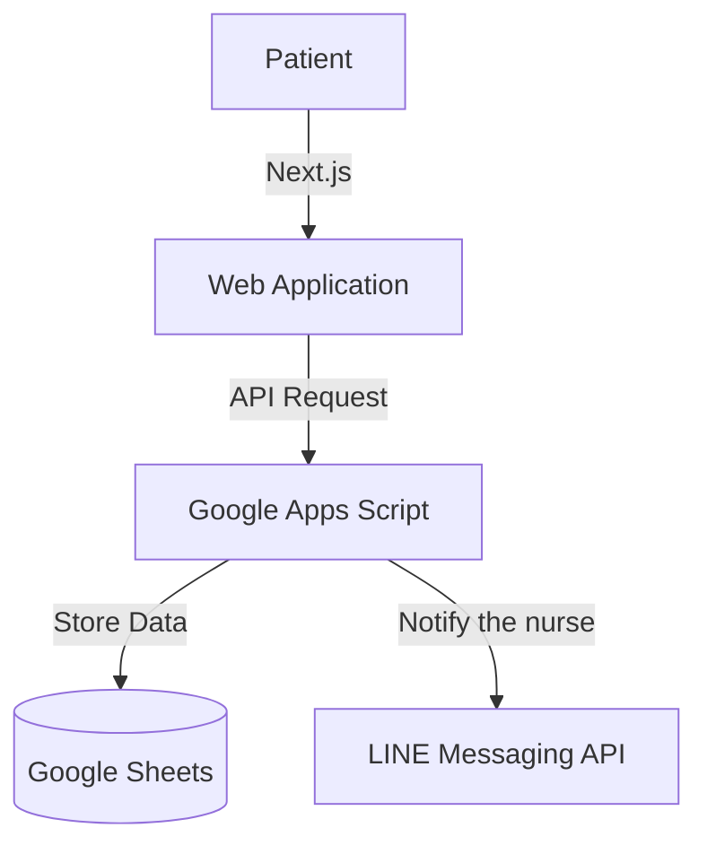

## Tech Stack

- Next.js
- Tailwind CSS
- LINE Messaging API
- Google Apps Script
- Google Sheets
- Vercel

## Architecture

## Coverage

- [News](https://www.kppmu.go.th/news-detail?hd=1&id=124000)
- [Newspaper](https://ratchanonnoknoy.vercel.app/1751867708230_50070_center.pdf#page=3)
